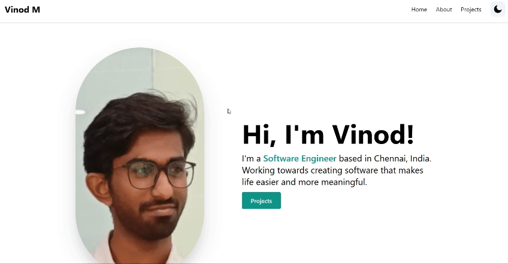

# Vinod's Portfolio

This is a template for creating a portfolio with Tailwind CSS and Next.js.



## How it works

Fork or download the repo and change whatever you need to change for your needs.

## Running Locally

Can run the application in VS Code or a terminal and it will be available at `http://localhost:3000`.

```bash
npm install
npm run dev
```

## Contact Feature

The portfolio now includes a contact form that sends messages via email using an API route. Configure the SMTP settings by creating a `.env` file based on `.env.example`:

```bash
cp .env.example .env
# update the values with your SMTP credentials
```

Ensure the server has network access to your mail provider. Run `npm run dev` to start the application.
